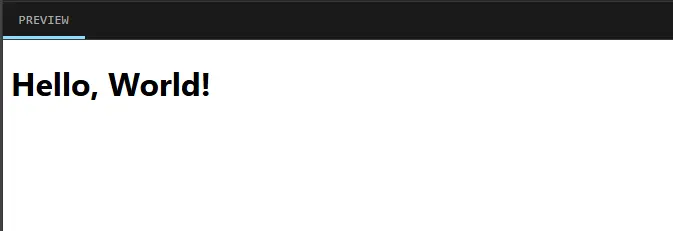
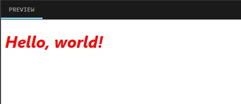
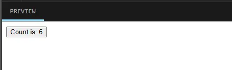
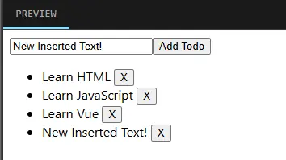

本文基于官方教程 https://cn.vuejs.org/tutorial/
在 [play.vuejs.org](https://play.vuejs.org) 中练习 Vue 组件编码，而不用每次都从零部署新项目。

# 一、基础
## 0. Vue 介绍
Vue 的组件是单文件组件（Single-File Component，SFC），封装在一个`.vue` 文件中。
一个组件 .vue 文件由三部分组成，脚本`<script>`，模板`<template>` 和 样式 `<style>`。
```vue
<script>
export default {
  // data() 返回的属性将会成为响应式的状态
  // 并且暴露在 `this` 上
  data() {
    return {
      count: 0
    }
  },

  // methods 是一些用来更改状态与触发更新的函数
  // 它们可以在模板中作为事件处理器绑定
  methods: {
    increment() {
      this.count++;
    }
  },

  // 生命周期钩子会在组件生命周期的各个不同阶段被调用
  // 例如这个函数就会在组件挂载完成后被调用
  mounted() {
    console.log(`The initial count is ${this.count}.`)
  }
}
</script>

<template>
  <button @click="count++">Count is: {{ count }}</button>
</template>

<style scoped>
button {
  font-weight: bold;
}
</style>
```
其中，`data()` 函数返回了组件的响应式的状态，`methods` 变量中定义了用到的函数，这些属性都会暴露在`this` 中。

## 1. 声明式渲染

Vue 的核心功能是**声明式渲染**：通过扩展于标准 HTML 的模板语法，我们可以根据 JavaScript 的状态来描述 HTML 应该是什么样子的。当状态改变时，HTML 会自动更新。

能在改变时触发更新的状态被认为是响应式的。在 Vue 中，响应式状态被保存在组件中。

```vue
<script>
export default {
  data() {
    return {
      name: "World"
    }
  }
}
</script>

<template>
  <h1>Hello, {{name}}!</h1>
</template>
```


如上例，在模板中，使用双花括号可以引用`data`中的变量。

## 2. Attribute 绑定
花括号引用只能使用在文本中。而在模板代码中使用 `v-bind:xxx` 可以给标签绑定对应的属性，如 `v-bind:id` 可以绑定 HTML 标签中的 `id` 属性，`v-bind:class` 可以绑定标签中的 `class` 属性，诸如此类。
```vue
<div v-bind:id="myid"></div>
```
`v-bind:` 语法可以简写，仅保留冒号，如 `:id`、`:class`。
```vue
<div :id="myid" :class="myclass"></div>
```

下例中，绑定了标签的`id` 和`class` 属性：
```vue
<script>
export default {
  data() {
    return {
      myClass: 'titleClass',
      myId: 'titleId'
    }
  }
}
</script>

<template>
  <h1 :class="myClass" :id="myId">Hello, world!</h1>
</template>

<style>
  .titleClass {
    color: red;
  }
  #titleId {
    font-style: italic;
  }
</style>
```


## 3. 绑定事件
使用 `v-on:xxx` 指令（也可以简写为`@xxx`）监听 DOM 事件。如：
```vue
<button v-on:click="increment">{{ count }}</button>
<button @click="increment">{{ count }}</button>
```
如上例，绑定了事件之后，当进行点击按钮时，会调用`methods` 中定义的函数。

```
<script>
export default {
  data() {
    return {
      count: 0
    }
  },
  methods:{
    increment() {
      this.count++;
    }
  }
}
</script>

<template>
  <button @click = "increment">Count is: {{ count }}</button>
</template>
```
上例中，当点击了按钮，会调用 `methods` 中定义的 `increment` 函数。当 `count` 变量改变后，界面会实时更新。




## 4. 表单绑定
`v-model` 指令会将被绑定的值与输入控件的值自动同步，这样我们就不必再使用事件处理函数了。
支持的控件见：[指南 - 表单绑定](https://cn.vuejs.org/guide/essentials/forms.html)

如下例，会将 `<input>` 输入框中的文字同步到 `<p>` 标签中：
```vue
<script>
export default {
  data() {
    return {
      text: ''
    }
  }
}
</script>

<template>
  <input v-model="text" placeholder="Type here">
  <p>{{ text }}</p>
</template>
```

## 5. 条件渲染
使用 `v-if` 指令可以控制控件的显示与否。
```vue
<h1 v-if="awesome">Vue is awesome!</h1>
<h1 v-else>Oh no 😢</h1>
```
当 `v-if` 绑定的变量为 true 时，显示该控件；否则不显示该控件。`v-else` 是可选的，当`v-if` 中的条件不满足时，显示`v-else` 中的控件。

如下例，每当点击按钮时，`awesome` 变量取反，显示的控件则相应发生变化：
```vue
<script>
export default {
  data() {
    return {
      awesome: true
    }
  },
  methods: {
    toggle() {
      this.awesome = !this.awesome
    }
  }
}
</script>

<template>
  <button @click="toggle">Toggle</button>
  <p>awesome = {{awesome}}</p>
  <h1 v-if="awesome">Vue is awesome!</h1>
  <h1 v-else>Oh no 😢</h1>
</template>
```

# 6. 列表渲染
我们可以使用 v-for 指令来渲染一个基于源数组的列表：
```vue
<ul>
  <li v-for="todo in todos" :key="todo.id">
    {{ todo.text }}
  </li>
</ul>
```
语法逻辑与`for` 语句相同。

如下例，会根据`todos` 列表，动态显示其中的文字。当点击添加或删除按钮，列表发生改变时，对应的界面也会发生改变：
```vue
<script>
// 给每个 todo 对象一个唯一的 id
let id = 0

export default {
  data() {
    return {
      newTodo: '',
      todos: [
        { id: id++, text: 'Learn HTML' },
        { id: id++, text: 'Learn JavaScript' },
        { id: id++, text: 'Learn Vue' }
      ]
    }
  },
  methods: {
    addTodo() {
      this.todos.push({ id: id++, text: this.newTodo })
      this.newTodo = ''
    },
    removeTodo(todo) {
      this.todos = this.todos.filter(item => item.id != todo.id)
    }
  }
}
</script>

<template>
  <form @submit.prevent="addTodo">
    <input v-model="newTodo" required placeholder="new todo">
    <button>Add Todo</button>
  </form>
  <ul>
    <li v-for="todo in todos" :key="todo.id">
      {{ todo.text }}
      <button @click="removeTodo(todo)">X</button>
    </li>
  </ul>
</template>
```


## 7. 计算属性
在 `export default` 代码段中，可以添加 `computed` 属性，与 `data`、`methods` 同级别。如：
```vue
<script>
export default {
  data() {
    return {
      // ...
    }
  },
  computed: {
    // ...
  },
  methods: {
    // ...
  }
}
</script>

<template>
  // ...
</template>
```
`compute` 中可以定义一个响应式的属性。也即是，该属性会监听其所依赖的属性，当其发生变化时而进行相应。如下例中：
```vue
<script>
export default {
  data() {
    return {
      hideCompleted: false,
      todos: [
        { id: id++, text: 'Learn HTML', done: true },
        { id: id++, text: 'Learn JavaScript', done: true },
        { id: id++, text: 'Learn Vue', done: false }
      ]
    }
  },
  computed: {
    filteredTodos() {
      return this.todos.filter( (t) => !this.hideCompleted || !t.done )
    }
  }
}
</script>
```
定义了一个`filteredTodos` 属性，表示筛选后的 todo 对象。其状态会根据 `this.hideCompleted` 和 `t.done` 两个属性进行更新。据此，可以更新 `6. 列表渲染` 中的例子，使其隐藏已完成的待做事件。
```vue
<script>
let id = 0

export default {
  data() {
    return {
      newTodo: '',
      hideCompleted: false,
      todos: [
        { id: id++, text: 'Learn HTML', done: true },
        { id: id++, text: 'Learn JavaScript', done: true },
        { id: id++, text: 'Learn Vue', done: false }
      ]
    }
  },
  computed: {
    // 根据 this.hideCompleted 和 t.done 来确认该项是否显示
    filteredTodos() {
      return this.todos.filter( (t) => !this.hideCompleted || !t.done )
    }
  },
  methods: {
    addTodo() {
      this.todos.push({ id: id++, text: this.newTodo, done: false })
      this.newTodo = ''
    },
    removeTodo(todo) {
      this.todos = this.todos.filter((t) => t !== todo)
    }
  }
}
</script>

<template>
  <form @submit.prevent="addTodo">
    <input v-model="newTodo" required placeholder="new todo">
    <button>Add Todo</button>
  </form>
  <ul>
    <!--   从筛选过的todo列表中遍历   -->
    <li v-for="todo in filteredTodos" :key="todo.id">
      <input type="checkbox" v-model="todo.done">
      <!-- 如果todo.done为true，则done类会被添加到<span>元素上；如果为false，则done类不会被添加。 -->
      <span :class="{ done: todo.done }">{{ todo.text }}</span>
      <button @click="removeTodo(todo)">X</button>
    </li>
  </ul>
  <button @click="hideCompleted = !hideCompleted">
    {{ hideCompleted ? 'Show all' : 'Hide completed' }}
  </button>
</template>

<style>
.done {
  text-decoration: line-through;
}
</style>
```

## 8. 生命周期和模板引用

通过`ref` 属性，可以访问DOM 中的元素。如：
```vue
<p ref="pElementRef">hello</p>
```
在组件挂载之后，可以通过`this.$ref.pElementRef` 来访问这个元素。
```vue
export default {
  mounted() {
    // 此时组件已经挂载。
  }
}
```
如上，在`mounted` 函数中，表示组件已经挂载。

在如下代码中，会在组件挂载完成时，将 `<p>` 标签中的文字从 `Hello` 修改为 `World`：
```vue
<script>
export default {
  mounted() {
    this.$refs.pElementRef.textContent = "World"
  }
}
</script>

<template>
  <p ref="pElementRef">Hello</p>
</template>
```

与`mounted` 类似的生命周期函数还包括 `created`、`updated` 等。见：[生命周期图示](https://cn.vuejs.org/guide/essentials/lifecycle.html#lifecycle-diagram)

## 9. 侦听器

可以通过在`export default` 的 `watch` 块中，定义属性变化的监听器。如下：
```vue
export default {
  data() {
    return {
      count: 0
    }
  },
  watch: {
    count(newCount) {
      // 在这里执行监听的逻辑
    }
  }
}
```
上述代码监听了`count` 变量的值，并在其进行变化时进行处理。

下列代码中，监听了当前的`todoId`。当组件挂载完成，或者 `todoId` 改变时，调用 `fetchData` 函数进行模拟数据的获取。
```vue
<script>
export default {
  data() {
    return {
      todoId: 1,
      todoData: null
    }
  },
  methods: {
    async fetchData() {
      this.todoData = null
      const res = await fetch(
        `https://jsonplaceholder.typicode.com/todos/${this.todoId}`
      )
      this.todoData = await res.json()
    }
  },
  mounted() {
    this.fetchData()
  },
  watch: {
    todoId(newId) {
      this.fetchData()
    }
  }
}
</script>

<template>
  <p>Todo id: {{ todoId }}</p>
  <button @click="todoId++" :disabled="!todoData">Fetch next todo</button>
  <p v-if="!todoData">Loading...</p>
  <pre v-else>{{ todoData }}</pre>
</template>
```

## 10. 组件
父组件可以在模板中渲染另一个组件作为子组件。使用子组件的步骤分为三步：导入、注册、使用。
下列代码中，使用了 `ChildComp.vue` 文件中定义的子组件：
```vue
<script>
  // 导入子组件
  import ChildComp from './ChildComp.vue'
export default {
  // 注册子组件
  components: {
    ChildComp
  }
}
</script>

<template>
  <!-- 使用子组件 -->
  <ChildComp />
</template>
```

##  11. 数据传递
子组件可以通过`props` 从父组件接收动态数据。格式如下：
```vue
// 在子组件中
export default {
  props: {
    // 参数名称: 参数类型
    msg: String
  }
}
```
在 `props` 中定义的参数，使用方法同 `data()` 中定义的数据相同，暴露在 `this` 上。

父组件通过标签中的属性值来传递数据。例如：
```vue
<script>
import ChildComp from './ChildComp.vue'

export default {
  components: {
    ChildComp
  },
  data() {
    return {
      greeting: 'Hello from parent'
    }
  }
}
</script>

<template>
  <ChildComp :msg = "greeting"/>
</template>
```
代表将父组件中的 `greeting` 变量以 `msg` 参数传递给子组件，类似于构造函数。

**要点：**
- 子组件在`props` 属性中，定义参数名称和类型；
- 父组件在调用子组件标签时，通过传入`:参数名="变量名"` 的形式，将变量值通过参数形式传递给子组件；

## 12. 事件传递

子组件可以向父组件触发事件，且可以携带参数，类似于回调函数。
在子组件中声明：
```vue
export default {
  // 声明触发的事件
  emits: ['response'],
  created() {
    // 带参数触发
    this.$emit('response', 'hello from child')
  }
}
```
上述代码中，表示当子组件创建完毕时，立即触发父组件指定的`response` 事件，并且参数为`hello from child`。

在父组件中，指定该事件触发的逻辑：
```vue
<script>
import ChildComp from './ChildComp.vue'

export default {
  components: {
    ChildComp
  },
  data() {
    return {
      childMsg: 'No child msg yet'
    }
  }
}
</script>

<template>
  <ChildComp @response="(msg) => childMsg = msg" />
  <p>{{ childMsg }}</p>
</template>
```
上述代码中，表示接收子组件传递的 `response` 事件，并且执行指定的逻辑表达式。
此处，执行的逻辑除了可以直接填入lambda表达式，也可以填入想要调用的函数名，如下：
```vue
<script>
  // .. 
  methods: {
    onMessage(msg) {
      this.childMsg = msg
    }
  }
  // ...
</script>

<template>
  <ChildComp @response="onMessage" />
  <p>{{ childMsg }}</p>
</template>
```
执行结果与前者相同。

**要点：**
- 子组件的`emits` 属性中声明触发的事件；
- 子组件通过 `this.$emit(事件名称, 事件参数)` 来触发事件；
- 父组件在子组件标签参数中，加入`@事件名称= "触发逻辑"` 来定义事件逻辑；

## 13. 插槽（slot）

父组件可以通过插槽来将模板代码片传递给子组件。如下：
```vue
<template>
  <ChildComp>
    Hello, <span style="color:red">{{name}}</span>!
    <div><button @click="()=>name='World'">Change name</button></div>
  </ChildComp>
</template>
```
即标签内部的内容。

子组件通过`<slot>`标签获取传递过来的值：
```vue
<template>
  Slot from parent:  <slot>Default value</slot> 
</template>
```
如果父组件没有传递值，则显示默认内容。


**要点：**
- 插槽用于传递代码片段；
- 父组件调用子组件标签内部为传递的插槽；
- 子组件通过`<slot>`标签，获取父组件传递的插槽；
